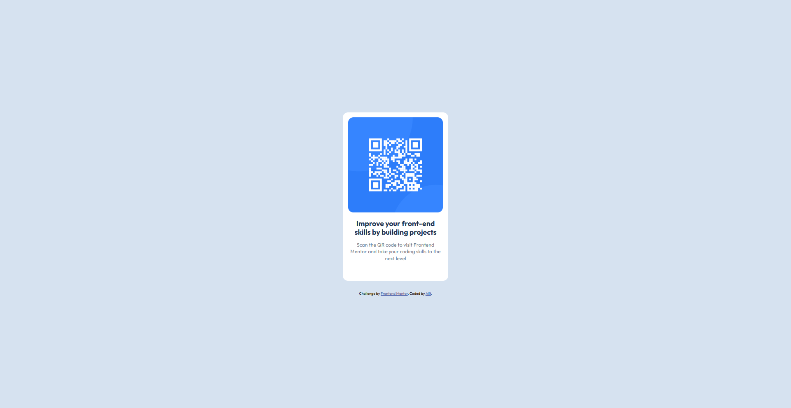

# Frontend Mentor - QR code component solution

This is a solution to the [QR code component challenge on Frontend Mentor](https://www.frontendmentor.io/challenges/qr-code-component-iux_sIO_H). Frontend Mentor challenges help you improve your coding skills by building realistic projects. 

## Table of contents

- [Frontend Mentor - QR code component solution](#frontend-mentor---qr-code-component-solution)
  - [Table of contents](#table-of-contents)
  - [Overview](#overview)
    - [Screenshot](#screenshot)
    - [Links](#links)
  - [My process](#my-process)
    - [Built with](#built-with)
    - [What I learned](#what-i-learned)
    - [Continued development](#continued-development)
    - [Useful resources](#useful-resources)
  - [Author](#author)

## Overview

This challenge involved creating a simple QR code component card that matches the provided Figma design. The component displays a QR code image with accompanying text in a clean, centered card layout.

### Screenshot



### Links

- Solution URL: [GitHub Repository](https://github.com/agusalit/FrontendChallenge-QR)
- Live Site URL: [GitHub Page](https://agusalit.github.io/FrontendChallenge-QR/)

## My process

### Built with

- Semantic HTML5 markup
- CSS custom properties (HSL color values)
- Flexbox for centering
- Google Fonts (Outfit)

### What I learned

This was my first time translating a Figma design to code, and I learned several valuable lessons:

**Design-to-Code Translation**: I practiced analyzing a visual design and breaking it down into HTML structure and CSS styling. This helped me understand how spacing, typography, and layout work together.

**CSS Flexbox Mastery**: I used flexbox for perfect centering, which taught me about the power of `justify-content` and `align-items`:

```css
body {
  display: flex;
  flex-direction: column;
  justify-content: center;
  align-items: center;
  width: 100vw;
  height: 100vh;
}
```

**HSL Color Values**: Working with HSL colors from the design system helped me understand this color format better:

```css
background-color: hsl(212, 45%, 89%);
color: hsl(218, 44%, 22%);
```

**Typography Precision**: I learned how to match typography exactly, including font weights, line heights, and letter spacing:

```css
h1 {
  font-size: 22px;
  line-height: 120%;
  font-weight: 700;
}
```

### Continued development

Areas I want to focus on in future projects:

- **Advanced CSS Layouts**: I want to practice with CSS Grid for more complex layouts
- **Responsive Design**: While this component works on mobile, I want to learn more about breakpoints and fluid typography
- **CSS Animations**: Adding subtle hover effects and micro-interactions to enhance user experience
- **Accessibility**: Learning about proper ARIA labels, focus states, and semantic HTML
- **CSS Custom Properties**: Using CSS variables for better maintainability

### Useful resources

- [CSS-Tricks Flexbox Guide](https://css-tricks.com/snippets/css/a-guide-to-flexbox/) - This guide helped me understand flexbox centering techniques
- [MDN HSL Colors](https://developer.mozilla.org/en-US/docs/Web/CSS/color_value/hsl) - Great resource for understanding HSL color format
- [Google Fonts](https://fonts.google.com/) - Used to import the Outfit font family

## Author

- Frontend Mentor - [@agusalit](https://www.frontendmentor.io/profile/agusalit)
- GitHub - [Alit Putra](https://github.com/agusalit)